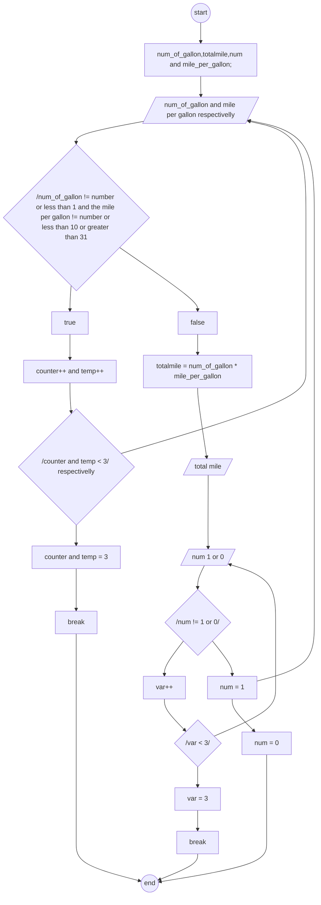

# An Automobile Fuel Tank

## Algorithm

**input**

 1. num_of_gallon and mile_per_gallon

**output**

 1. total mile

**process**

 1. declare the value of num_of_gallon,totalmile,num and mile_per_gallon.
 2. enter number of gallon an automobile containe.
 3. if the value of an gallon is a character or less than 1 give other chance and requaste again.
 4. also the user enter still invalide input, give a fied back and close the loop.
 5. enter the value of mile per gallon an automobile drive.
 6.  if the value of mile per gallon is a character or less than 10 or greater than 31 give other chance and re-quaste again.
 7.  also the user enter still invalide input, give a fied back and close the loop.
 8.  calculate the total mile an automobile can drive with out re-fuel.
 9.  ask countinue(1) or stop re-quaste(0).
 10. if the value the user enter is different from 1 or 0 give only one chance.
 11. still the value is not correct stop the loop.
 12. the user enter one goto step 2 but zero enp the loop.
   
## psedo-code

1. start
2. declare the value of num_of_gallon,totalmile,num and mile_per_gallon.
3. enter number of gallon an automobile containe.
4. if
   
   the num_of_gallon != number or less than 1 give only one chance.

     goto step 3.

 5. enter the value of mile per gallon an automobile drive.   

 6. if
   
   the mile per gallon != number or less than 10 or greater than 31 give only one chance,

    goto step 5. 

  7.   calculate the total mile,
   
           totalmile = num_of_gallon * mile_per_gallon
 8.  ask countinue(1) or stop(0) re-quaste.
 9.  if 
   
      enter 1 goto step 3

      enter num != 1 || 0 give only one chance
 10. stop
   
## flow-chart

