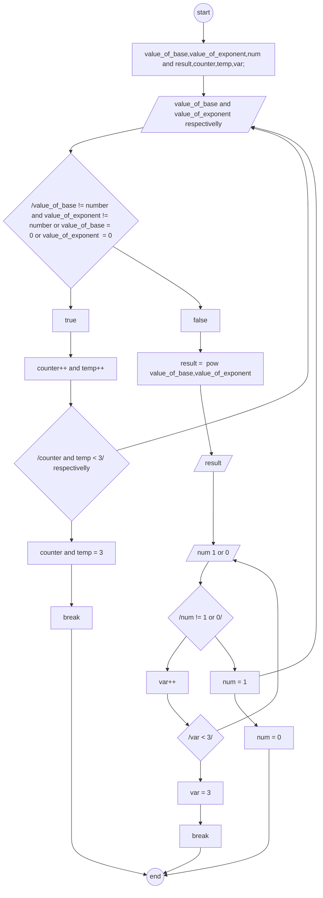

# Exponent and Power Calculator

## Algorithm

**input**
 1. base
 2. exponent

**output**
 1. result
 
 **process**
 1. declare value_of_base, value_of_exponent, result,num,counter,temp,var.
 2. enter the value of base and exponent.
 3. if the value of base is character give only one chance to enter number only and the value of exponent is also character and both value are 0 give only other chance.
 4. if the input still not correct break the loop.
 5. calculate the result.
 6. result =  pow(value_of_base,value_of_exponent).
 7. print result.
 8.  ask countinue(1) or stop re-quaste(0).
 9. if the value the user enter is different from 1 or 0 give only one chance.
 10. still the value is not correct stop the loop.
 11. the user enter one goto step 2 but zero enp the loop.
 
 ## Psedo-Code

 1. start
 2. declare value_of_base, value_of_exponent, result,num,counter,temp,var.
 3. enter the value of base and exponent.
 4. if 
     the value of base = char give only one chance then goto step3,
     the value of exponent = char or both values are 0 give  only other chance then goto step3.
 5. counter and temp respectively = 3 break the loop.
 6. calculate result
     
      result =  pow(value_of_base,value_of_exponent).
 7. print result.
 8. ask countinue(1) or stop(0) re-quaste.
 9.  if 
   
      enter 1 goto step 3

      enter num != 1 || 0 give only one chance
 10. stop
   
## Flow-chart

