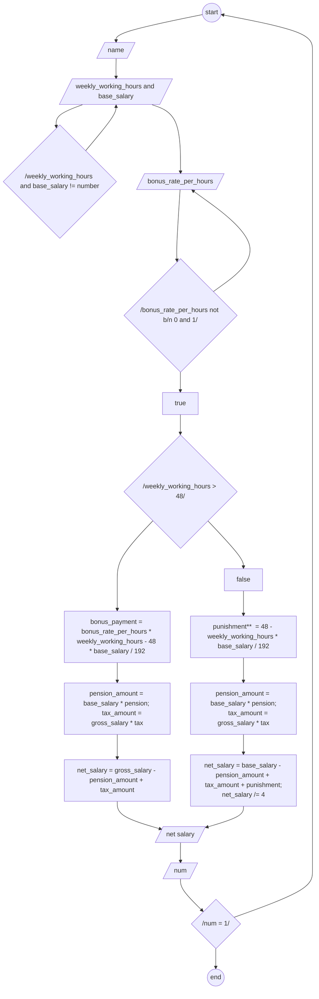

# Salary of an Ethiopian campany

## Algorithm

**input**

 1. name of employee
 2. weekly_working_hours
 3. base_salary
 
 **output**

 1. weekly net salary
   
**process**

 1. declar weekly_working_hours,base_salary,gross_salary,net_salary,bonus_payment,pension_amount,tax_amount,punishment,bonus_rate_per_hours;
 2. initialize float constant of pension and tax;
 3. enter the value of weekly_working_hours and base_salary.
 4. if the input is character give a chance to enter number only then goto step3.
 5. enter the value of bonus_rate_per_hours.
 6. if the input is character or number greater than 1 and less than 0 give a chance to enter number b/n 0 and 1 then goto step5.
 7. if weekly_working_hours > 48, calculate
      
      **bonus_payment**  = bonus_rate_per_hours * (weekly_working_hours - 48) * (base_salary / 192);              
     
     **gross_salary** = base_salary + bonus_payment;              
     
     **pension_amount** = base_salary * pension; 
     
     **tax_amount** = gross_salary * tax;              
     
     **net_salary** = gross_salary - (pension_amount + tax_amount);
     net_salary /= 4;
 8. if weekly_working_hours < 48, calculate
      
      **punishment**  = (48 - weekly_working_hours) * (base_salary / 192); // When the employee miss there own work or not exit.
      
      **pension_amount** = base_salary * pension;
      
      **tax_amount** = gross_salary * tax;
      
      **net_salary** = base_salary - (pension_amount + tax_amount + punishment);
      net_salary /= 4;

 9. print net salary.
 10. ask countinue(1) or stop re-quaste(0) only.
   
 ## psedo-code

 1. start
 2. declar weekly_working_hours,base_salary,gross_salary,net_salary,bonus_payment,pension_amount,tax_amount,punishment,bonus_rate_per_hours;
 3. initialize float constant of pension and tax;
 4. enter the value of weekly_working_hours and base_salary.
 5. if
     
     input is character give a chance to enter number only then goto step4.
 6. enter the value of bonus_rate_per_hours.
 7. if 
    
      the input is character or number greater than 1 and less than 0 give a chance to enter number b/n 0 and 1 then goto step6.
 8. if weekly_working_hours > 48, calculate
      
      **bonus_payment**  = bonus_rate_per_hours * (weekly_working_hours - 48) * (base_salary / 192);              
     
     **gross_salary** = base_salary + bonus_payment;              
     
     **pension_amount** = base_salary * pension; 
     
     **tax_amount** = gross_salary * tax;              
    
     **net_salary** = gross_salary - (pension_amount + tax_amount);
     net_salary /= 4;
 9. if weekly_working_hours < 48, calculate
      
      **punishment**  = (48 - weekly_working_hours) * (base_salary / 192); // When the employee miss there own work or not exit.
      
      **pension_amount** = base_salary * pension;
      
      **tax_amount** = gross_salary * tax;
      
      **net_salary** = base_salary - (pension_amount + tax_amount + punishment);
      net_salary /= 4;

 10. print net salary.
 11. ask countinue(1) or stop re-quaste(0) only.
 ## Flow-chart

 

