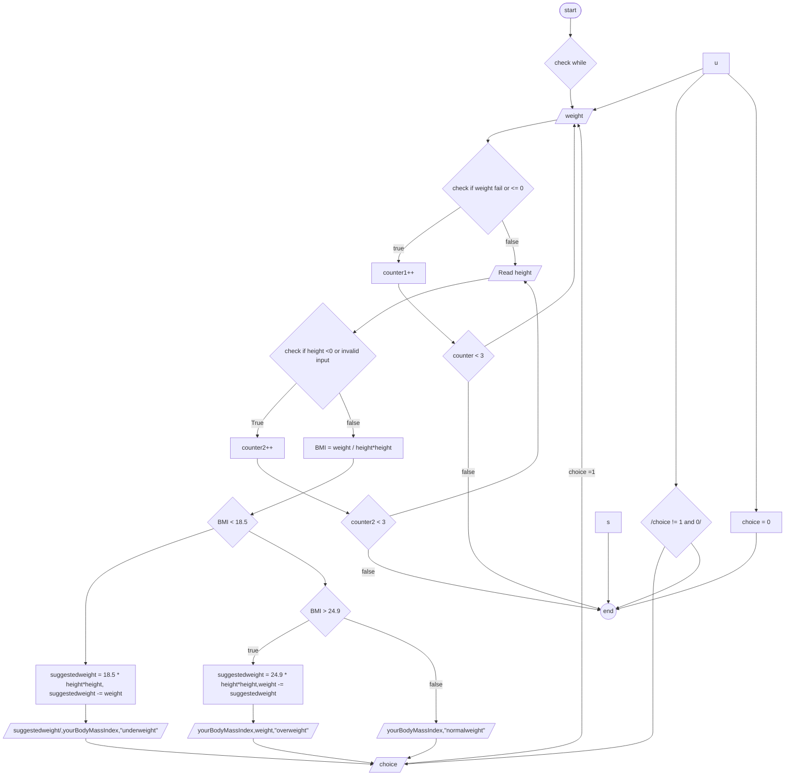

# problem analysis 
- **Input** : weight , height ,choice
- **Output** : yourBodyMassIndex ,suggestedWeight ,weight
- **Operation** : - Declare a float  variables for weight, height ,yourBodyMassIndex, and suggestedWeight.\
                   - Declare integer variables counter1,counter2,counter3 and initialize all counters by 0, temp, var for input attempts and num for controlling the loop.\
                    - Start a do-while loop that will continue as long as num equals 1.\
                    -check the While condition if true:\
                    -Read inputs  weight , height ,choice
                    -validate the inputs for weight to allow only a number greater than or equal to 0 only,and for height to allow a number greater than 0 only, allow a 3 attempt If validation fails after 3 attempts, display an error message and exit the loop.(If the input is invalid, read the inputs again again until counter =3).\
-calculate BMI(yourBodyMassIndex) using the formula, BMI = weight / height * height.
 -Format the yourBodyMassIndex value to 2 decimal places for display.\
  - check if yourBodyMassIndex is : underweight < 18.5; calculate suggestedweight = 18.5 * height *height then calculate weight needed(suggestedWeight) = suggestedWeight−weight\
-Display the yourBodyMassIndex and suggestedWeight.\
-check if BMI(yourBodyMassIndex): overweight > 24.9; calculate suggestedweight = 24.9 × height * height then calculate WeightNeeded = weight−suggestedWeight.\
-Display the BMI(yourBodyMassIndex) and weight loss suggestion(weight).\
-Read choice,for the user to choise if he/she want to continue or to exit.
- Validate the input, allowing up to 3 attempts. If validation fails, display an error and exit the program.
 check If the user enters 1 read weight again then coninue from that.\
  If the user enters 0, exit the loop and terminate the program.

  
#  pseudo code

- **step 1**: start
- **step 2**: check the while loop if:\
   2.1 true then go to step 3\
   2.2 false then go to step 11
- **step 3**: Read weight
- **step 4**: Increment counter1 by 1
- **step 5**: check if weight >=0\
           5.1 then go to step 6\
           5.2 else if counter1 =1 or counter2 =2 go to step 3
           5.3 else goto end

- **step 6**: Read height
- **step 7**: Increment counter by 1
- **step 8**: check if height >0\
           8.1 then go to step 9\
           8.2 else if counter2 =1 or counter2 =2 go to step 6
           8.3 else goto end
- **step9.**: Calculate yourBodyMassIndex as
```
yourBodyMassIndex =  weight / height * height
```
- **step 10**: check  if BMI < 18.5
10.1 then calculate suggested weight as 
      ``` suggestedweight = 18.5 * height *height ```and
   
the weight needed as ``` weight = suggestedWeight−weight``` and display yourBodyMassIndex ,suggestedWeight and "underweight"

  10.2 else goto step 11

   
 - **step 11**:  if yourBodyMassIndex > 24.9
   11.1 calculate suggested weight as : ```suggestedweight** = 24.9 × height * height```

WeightNeeded as : ```weight = weight−suggestedWeight.``` and Display yourBodyMassIndex,weight (the weight needed to lose) and "overweight"
11.2 else display yourBodyMassIndex and "normal weight"
- **step 11**: read choice   
- **step 12**: check if choice is 1 or 0 or invalid input\
            12.1 if 1 then go to step 3\
            12.2 else if  0 then go to step end\
            12.3 else if  invalid input and counter3 = 1 o go to step 15\
            12.4 else goto step 13

**step 13**: stop.

 # Flow-chart


 


