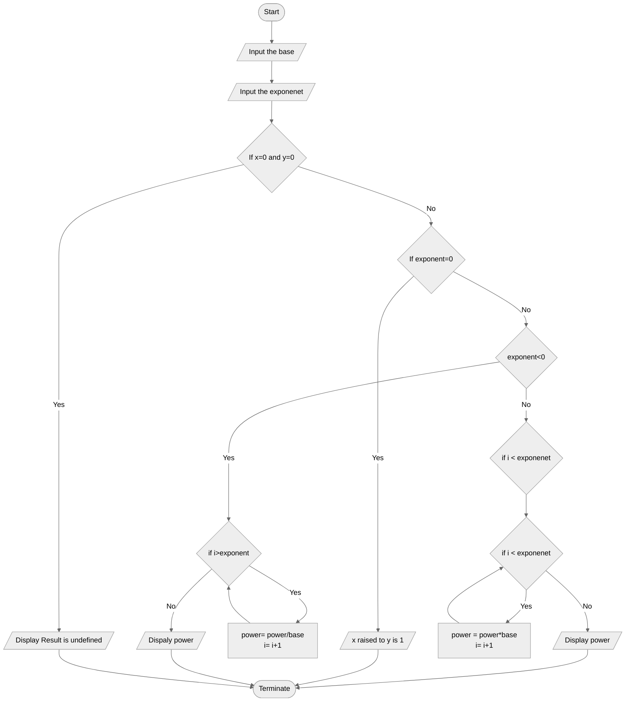

# Algorithm and Flowchart for Power Function Program

## Algorithm

1. **Start**: Begin the program.
2. **Input base and exponent**: Ask the user to input two integers, base \(X\) and exponent \(Y\).
3. **Check special cases**:
   - If \(X = 0\) and \(Y = 0\), display "undefined" and terminate the program.
   - If \(Y = 0\), the result is 1 (any number to the power of 0 is 1) and terminate the program.
4. **Calculate power**:
   - If \(Y > 0\): Multiply \(X\) by itself \(Y\) times.
   - If \(Y < 0\): Divide 1 by \(X\), \(|Y|\) times.
5. **Output result**: Display the result of \(X^Y\).
6. **End**: Terminate the program.

---

## Flowchart

